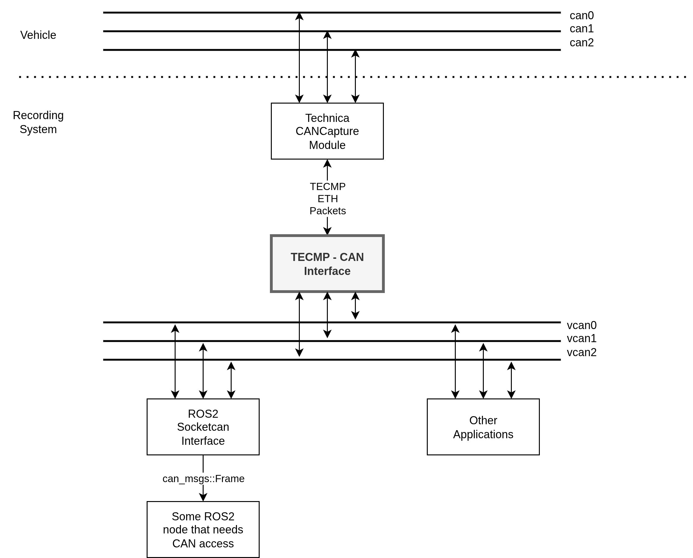

# TECMP CAN Interface


<!--    -->

*by* Georg Beierlein  
TUD - IAD - Professur für Fahrzeugmechatronik

*Last update:* 2026/05/07

## Description

Package used to decode TECMP frames on an ethernet socket (coming from a Technica CANCapture Module) to SocketCAN Interfaces for further processing.
Part of the research project [WALEMObase](www.walemo.de).

- Live sniffer for TECMP packages (ether type `0x99FE`) on ETH socket `eth0` (or another socket as specified via Arg)
- Supports mapping of the frames to multiple CAN channels depending on `channel ID` of the TECMP package.



## Dependencies

- [libtecmp](https://github.com/Technica-Engineering/libtecmp) for Decoding.

## Usage

⚠️ needs to run as `sudo`

```bash
sudo tecmp_can_interface_node [<interface_name>] 
```

Change the channel mapping in the constructor of the node:
`canChannels_` map the TECMP Channel ID to the `CanChannelInfo` struct.

```cpp
// - CAN Sockets
// Initialize CAN channels and map TECMP channel IDs -> SocketCAN info
// canChannels_[TECMP Channel ID] = {"<socket CAN name>", fileDescriptor, <some description>};
canChannels_[1] = {"vcan0", setupCanSocket("vcan0"), "Virtual CAN Channel 0"};
canChannels_[2] = {"vcan1", setupCanSocket("vcan1"), "Virtual CAN Channel 1"};
canChannels_[3] = {"vcan2", setupCanSocket("vcan2"), "Virtual CAN Channel 2"};
```

## Notes

- **needs to run as `root`**
- compile `libtecmp` as a `STATIC` library to be safely linked when executed as `root`
- for debugging in `VS Code` as `sudo` use the following snippet in `launch.json`:

    ```json
    "configurations": [
        {
        "name": "C++ Debugger with sudo",
        "type": "cppdbg",
        "request": "launch",
        "console": "integratedTerminal",
        "sudo": true,
        "cwd": "/",
        "program": "PATH-TO-YOUR-NODE"
        }
    ]
    ```
